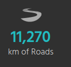
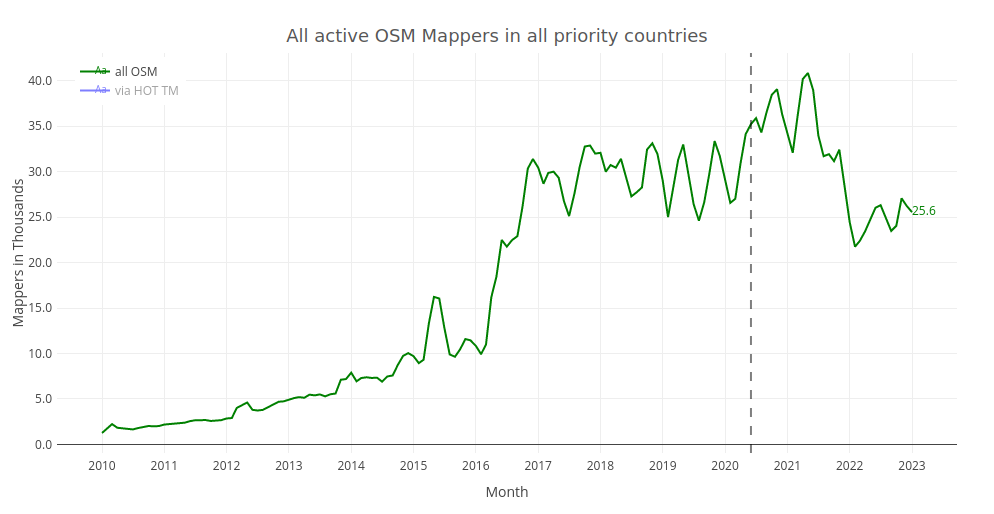
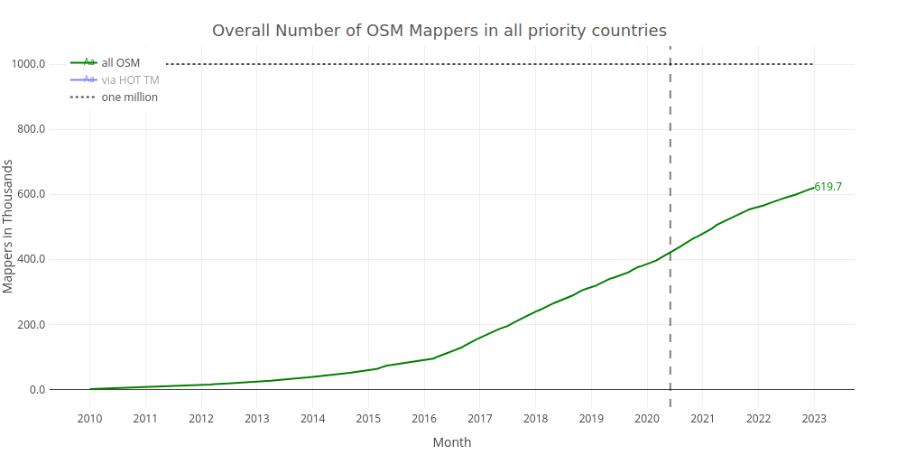
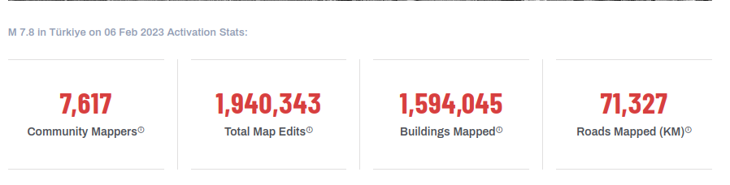
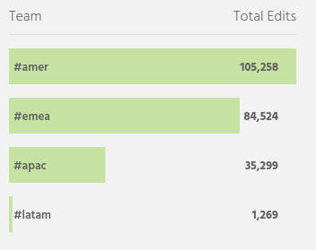

# Example Queries (EQs)
This section describes example queries using "pseudo"-code.
You can't use these queries directly, but should read them as a description of what should be analyzed.

### OSM Statistics:

Overview:
* [S00 Overview Stats](#s00-overview-stats)

OSM Contributors:
* [S01 Number of OSM Contributors](#s01-number-of-osm-contributors)
* [S05 Absolute Number of OSM Contributors by Temporal Unit](#s05-absolute-number-of-osm-contributors-by-temporal-unit)
* [S06 Cumulative Number of OSM Contributors by Temporal Unit](#s06-cumulative-number-of-osm-contributors-by-temporal-unit)

OSM Features Count:
* [S02 Number of Features Edited (e.g. total map edits)](#s02-total-map-edits)
* [S03 Number of Features Created (e.g. buildings added)](#s03-number-of-features-added)
* [S08 Number of Features Modified (e.g. buildings modified)](#s08-number-of-features-modified)
* [S09 Number of Features Deleted (e.g. buildings deleted)](#s09-number-of-features-deleted)
* [S12 Cumulative Number of Features](#s12-cumulative-number-of-features)

OSM Features Length:
* [S04 Added Length for Features Created or Modified (e.g. km of roads added)](#s04-length-of-features-added)
* [S10 Length of Features Deleted](#s10-length-of-features-deleted)
* [S12 Cumulative Length of Features](#s13-cumulative-length-of-features)

OSM Features Area:
* [S07 Added Area for Features Created or Modified (e.g. square kilometers forest added)](#s07-area-of-features-added)
* [S11 Area of Features Deleted](#s11-area-of-features-deleted)
* [S12 Cumulative Area of Features](#s14-cumulative-area-of-features)

Optional:
* [S99 Number of OSM Changesets](#s99-number-of-osm-changesets--optional-)
* [S99 Proportion of Hashtag Map Edits on all OSM Map Edits](#s99-proportion-of-hashtag-map-edits-on-all-osm-map-edits--optional-)
* [S99 Proportion of HOT Tasking Manager Users on all OSM Contributors](#s99-proportion-of-hot-tasking-manager-users-on-all-osm-contributors--optional-)
* [S99 Number of OSM Contributors for given Filter Topic (e.g. buildings)](#s99-number-of-osm-contributors-for-given-filter-topic--optional-)

## Filter Dimensions
* [F01 Filter by Hashtag](#f01-filter-by-hashtag)
* [F02 Filter by Hashtag with Wildcard](#f02-filter-by-hashtag-with-wildcard)
* [F03 Filter by Time Range](#f03-filter-by-time-range)
* [F04 Filter by Intersection of Hashtags (AND)](#f04-filter-by-intersection-of-hashtags)
* [F05 Filter by Union of Hashtags (OR)](#f05-filter-by-union-of-hashtags)
* [F06 Filter by Country](#f06-filter-by-country)

Optional:
* [F99 Filter by OSM User ID](#f99-filter-by-osm-user-id--optional-)
* [F99 Filter by Topic](#f99-filter-by-osm-user-id--optional-)

### Grouping Dimensions
* [A01 Group by Hashtag](#a01-group-by-hashtag)
* [A02 Group by Temporal Unit](#a02-group-by-temporal-unit)
* [A03 Group by Country](#a03-group-by-country)

Optional:
* [A99 Group by OSM User ID](#a99-group-by-osm-user-id--optional-)
* [A99 Group by Editor]()

### Definitions
* [Hashtags](#hashtags)
* [Filter Topics](#filter-topics)
* [Time Range and Time Interval](#time-range-and-time-interval)
* [Datasets](#datasets)

## OSM Statistics
### S00 Overview Stats
```sql
select
    count(distinct changeset_id) as n_changesets
    ,count(distinct osm_user_id) as n_contributors
    ,sum(road_length_delta) as roads_km_added
    ,sum(buildings_added) as n_buildings_added
    ,sum(primary_map_edits) as n_total_map_edits
from contributions
where
hashtag = 'missingmaps';
```

This is the most frequently used endpoint by the current [osmstats-api](https://github.com/hotosm/osm-stats/blob/master/documentation/API.md). This provides an overview on several OSM statistics which are explained in more detail for the example queries below.

```json
{
   "changesets": 78780,
   "users": 11650,
   "roads": 179989.04738327922,
   "buildings": 788602,
   "edits": 979390,
   "latest": "2016-07-15T04:36:58.000Z"
 }
```


### S01 Number of OSM Contributors
```sql
select
count(distinct osm_user_id) as n_contributors
from contributions
where
hashtag = 'missingmaps';
```

This is the number of distinct OSM users that contributed at least one changeset to a particular hashtag since the start of collecting data.
This is the very first number displayed on the company leaderboards as `contributors`.


### S02 Total Map Edits
```sql
select
count(*) as n_total_map_edits
from contributions
where
hashtag = '#your_hashtag';
```

This is the sum of the [primary map features](#primary-map-features) edited in OSM contributed to a particular hashtag since the start of collecting data.
This should consider only edits for OSM elements with the tag keys defined in the OSM Wiki as [Map Features](https://wiki.openstreetmap.org/wiki/Map_features).
In general, we want to avoid "exponentially exploding" statistics for counting total map edits, such as considering each edit to nodes without any tags.

This is the second number displayed on the company leaderboards as `Total Edits`.
(It is not clear what `Total Edits` exactly means for the osmstats-api.)


Examples for map edit:
* Create a building in OSM with 4 nodes (without tags) and 1 way with the tag `building=yes`. This change should be counted as 1 map edit.
* Create a new road in OSM and tags it with `highway=primary`. This change should be counted as 1 map edit.
* Modify the tag of an existing road in OSM from `highway=primary` to `highway=secondary`. This change should be counted as 1 map edit.
* Modify the geometry of an existing building in OSM  and moves 2 nodes. This change should be counted as 1 map edit. (This is a minor edit for the building from OpenStreetMap History Database (OSHDB) perspective.)
* Split a road into two parts. This results in a modification for the existing road part, and a creation for the other road part. This change should be counted as 2 map edits.
* Simplify the geometry of an existing building by removing 5 out of 9 nodes for this way. This change should be counted as 1 map edit. (This will also result in a new version for the OSM way as the list of node members changed.)
* Remove the tag `building=yes` from an existing way. The way remains with other tags (or maybe even no tags at all). This change should be counted as 1 map edit.
* Add the tag `highway=unclassified` to an existing way without any tags. This change should be counted as 1 map edit.
* Add the tag `short_name=HeiGIT` to an existing node tagged as `office=research`. This change should be counted as 1 map edit.
* Delete a building (way and all nodes). This change should be counted as 1 map edit.
* Delete a road (delete the way, but not all nodes). This change should be counted as 1 map edit.

Examples for **NO** map edit:
* Create, move or delete a node, way or relation in OSM which has no tags. This change should NOT be counted as map edit.
* Create a node with the tag `source=survey`, but which has no other tag defined. This change should NOT be counted as map edit.


### S03 Number of Features Added
```sql
select
count(*) as n_buildings_added_to_osm
from contributions
where
hashtag = '#your_hashtag' AND
topic_name = 'buildings' AND
contribution_type = 'created';
```

This query should be available for all filter topics.
This is the number of OSM features newly tagged as buildings/roads/any-other-topic-name according to the [definitions above](#tag-filter-definitions-for-topics).
The number of features added considers a) newly created OSM features and also b) specific tag changes to existing OSM features.

When considering buildings, this should be the third number on the company leaderboards, which is currently displayed as `Building Edits`.
(It is not clear what `Building Edits` exactly means for the osmstats-api.)


examples for feature added:
* Create 1 new way (and 4 new nodes without tags) tagged as `building=house`. This change should be counted as 1 building added to OSM.
* Modify an existing way tagged as `amenity=school` by adding the tag `buildng=yes`. This change should be counted as 1 building added to OSM.

examples for **NO** feature added:
* Create 1 new way (and 4 new nodes) tagged as `building=no`. This change should NOT be counted as building added to OSM according to the filter definition for buildings because the value `no` is not in the list of considered tag values.

### S04 Length of Features Added
```sql
select
sum(delta_length_km) as road_length_added_to_osm
from contributions
where
hashtag = '#your_hashtag AND
topic_name = 'roads' AND
contribution_type IN ('created', 'geometry-change', 'tag-and-geometry-change');
```

This query should be available for all topics for which the unit `length` is specified.
This is length of OSM features which are newly tagged as /roads/any-other-topic-name according to the [definitions above](#tag-filter-definitions-for-topics) and also considers the change in length when the geometry of existing /roads/any-other-topic-name is modified.
Changes that only modify tags, but not the geometry of a feature, are not considered.
The change in length resulting from deletions is not considered.

When considering roads, this should be the fourth number on the company leaderboards, which is currently displayed as `km of Roads`.
(It is not clear what `km of Roads` exactly means for the osmstats-api.)




### S05 Absolute Number of OSM Contributors by Temporal Unit
This is similar to the user statistics provided on [humstats](https://humstats.heigit.org/hot-priority-countries.html).



### S06 Cumulative Number of OSM Contributors by Temporal Unit
This is similar to the user statistics provided on [humstats](https://humstats.heigit.org/hot-priority-countries.html).



### S07 Area of Features Added
tbd

### S08 Number of Features Modified
tbd

### S09 Number of Features Deleted
tbd

### S10 Length of Features Deleted
tbd


### S11 Area of Features Deleted
tbd

### S12 Cumulative Number of Features
This is the sum of `{filter_topic}_count`.
Assuming that a deletion results in a negative value of `-1` for `{filter_topic}_count`.
This kind of query is useful when you want to obtain the overall number of buildings in OSM, e.g. per country.

### S13 Cumulative Length of Features
This is the sum of `{filter_topic}_length_delta`.
Assuming that a deletion results in a negative value for `{filter_topic}_length_delta`
This kind of query is useful when you want to obtain the overall length of the road network in OSM, e.g. per country.

### S14 Cumulative Area of Features
This is the sum of `{filter_topic}_area_delta`.
Assuming that a deletion results in a negative value for `{filter_topic}_area_delta`.
This kind of query is useful when you want to obtain the overall length of the road network in OSM, e.g. per country.


### S99 Number of OSM Changesets (optional)
```sql
select
count(distinct changeset_id) as n_changesets
from contributions
where
hashtag = '#your_hashtag';
```

This is the number of distinct OSM changesets contributed to a particular hashtag since the start of collecting data.
This number is of less important for partners or reporting at mapathons and often this causes confusion.

However, this number will be helpful to compare different processing approaches.

### S99 Proportion of Hashtag Map Edits on all OSM Map Edits (optional)
tbd

### S99 Proportion of HOT Tasking Manager Users on all OSM Contributors (optional)
tbd

### S99 Number of OSM Contributors for given Filter Topic (optional)
tbd

## Filter Dimensions
### F01 Filter by Hashtag
```sql
select *
from contributions
where
    hashtag = '#bloomberg'
```

### F02 Filter by Hashtag with Wildcard
```sql
select *
from contributions
where
    hashtag like `#hotosm-projet-%`
```

### F03 Filter by Time Range
```sql
select * 
from contributions
where
    changeset_timestamp >= 2022-05-01
    and changeset_timestamp < 2022-06-15;
```

This will give you something like highlighted below for mapping in the aftermaths of the 2023 Turkey/Syria Earthquake.



### F04 Filter by Intersection of Hashtags (AND)
```sql
with first_hashtag_filter as (
    select
    *
    from contributions
    where hashtag = '#amer'
)
select
  count(distinct contrib_id_text)
from contributions, first_hashtag_filter
where
    contributions.changeset_id = first_hashtag_filter.changeset_id
    AND
    contributions.hashtag = '#bloomberg'
```

This counts contributions for the intersection of both (all) hashtags provided.
In the example above this considers all changesets with the hashtag `#bloomberg` **and** the hashtag `#amer`.

### F05 Filter by Union of Hashtags (OR)
```sql
select
    count(distinct user_id)
from contributions
where
    hashtag = '#bloomberg' or hashtag = '#amer'
```

### F06 Filter by Country
tbd

### F99 Filter by OSM User ID (optional)
tbd

### F99 Filter by Topic (optional)
tbd

## Grouping Dimensions
### A01 Group by Hashtag
```sql
select
    hashtag
    ,count(distinct user_id) as n_distinct_users
from contributions
where hashtag in ('#bloomberg', '#amer', '#emea', '#apac', '#latam')
group by hashtag;
```

This is reported on the company leaderboards, which is currently displayed in "Activity" section.
(It is not clear if these numbers should better filter for the intersection of `#bloomberg` **and** `#amer`.)




### A02 Group by Temporal Unit
```sql
select
    toYear(changeset_timestamp) as year
    ,count(distinct user_id) as n_distinct_users
from contributions
where hashtag = '#missingmaps'
group by year;
```

### A03 Group by Country
tbd


### A99 Group by OSM User ID (optional)
tbd

### A99 Group by Editor
e.g. group by `JOSM 1.5` or `iD 2.20.2`.


# Definitions
## Hashtags
Hashtags should be case-insensitive. This means that when you are adding `#missingmaps` or `#MissingMaps` or `#missingMaps` to a OSM changeset comment this will all be counted towards lower case `missingmaps`. This is currently the case for the processing of the osmstats-api.

The following hashtags are considered for testing and validating the example queries:
* `#missingmaps`
* `#MissingMaps` (should tive the same results as `missingmaps`) 
* `#bloomberg`
* `#amer` (this is used in combination with `#bloomberg`)
* `#visa`
* `#hotosm-project-14154`
* `#hotosm-project-*` (uses `*` as a wildcard to get all HOT Tasking Manager projects)

## Filter Topics
Topics are described by pre-defined filters which consider OSM Type, Geometry Type, tag keys and tag values. For each topic one or more units are assigned, which describe the kind of summary statistics that will be provided.

### Filter Definitions for Topics

### Primary Map Features
| Property       | Description                                                                                                                                                                                                                                                                  | 
|----------------|------------------------------------------------------------------------------------------------------------------------------------------------------------------------------------------------------------------------------------------------------------------------------|
| Topic Name     | Primary Map Features                                                                                                                                                                                                                                                         |
| OSM Type       | node, way, relation                                                                                                                                                                                                                                                          |
| Geometry Type  | Point, Linestring, Polygon, MultiPolygon, GeometryCollection                                                                                                                                                                                                                 |
| OSM Tag Key    | aerialway, aeroway, amenity, barrier, boundary, building, craft, emergency, geological, healthcare, highway, historic, landuse, leisure, man_made, military, natural, office, place, power, public_transport, railway, route, shop, sport, telecom, tourism, water, waterway |
| OSM Tag Value  | * (any value is considered)                                                                                                                                                                                                                                                  |
| Unit           | count                                                                                                                                                                                                                                                                        |
| Validity Check | -                                                                                                                                                                                                                                                                            |
When referring to the total number of map edits, we will play this filter definition. The "primary map features" are described in the [OSM Wiki](https://wiki.openstreetmap.org/wiki/Map_features#Highway) as an attempt to foster coherence at the key-level and provide a list of tags grouped by topic. The Map Features list currently contains 29 keys or object types.

### Buildings
| Property       | Description                                                                            | 
|----------------|----------------------------------------------------------------------------------------|
| Topic Name     | Buildings                                                                              |
| OSM Type       | way, relation                                                                          |
| Geometry Type  | Polygon, MultiPolygon                                                                  |
| OSM Tag Key    | building                                                                               |
| OSM Tag Value  | yes, house, residential, detached, detached, garage, apartments, shed, hut, industrial |
| Unit           | count, area [sqkm]                                                                     |
| Validity Check | delta area < 1,000,000 square meters                                                   |

These tag values account for more than 95% of all OSM features tagged with the building key according to [taginfo](https://taginfo.openstreetmap.org/keys/building#values).

### Roads
| Property       | Description                                                                                                                                      | 
|----------------|--------------------------------------------------------------------------------------------------------------------------------------------------|
| Topic Name     | Roads                                                                                                                                            |
| OSM Type       | way, relation                                                                                                                                    |
| Geometry Type  | Linestring                                                                                                                                       |
| OSM Tag Keys   | highway                                                                                                                                          |
| OSM Tag Values | motorway, trunk, motorway_link, trunk_link, primary, primary_link, secondary, secondary_link, tertiary, tertiary_link, unclassified, residential |
| Unit           | count, length [km]                                                                                                                               |
| Validity Check | delta length < XXX meters                                                                                                                        |

These are the principal tag values for the road network and the link roads as defined in the [OSM Wiki](https://wiki.openstreetmap.org/wiki/Map_features#Highway). Special road types (e.g. tracks, paths or footways) are not considered in this topic.

## Time Range and Time Interval
* osm-stats API contains changesets from `20XX-xx-xx`
* changeset DB contains changesets from the beginning of OSM

## Datasets
comparison of different approaches:
* osmstats-api
* OSM changeset DB (+ OSHDB)
* parquet file with OSHDB contributions
