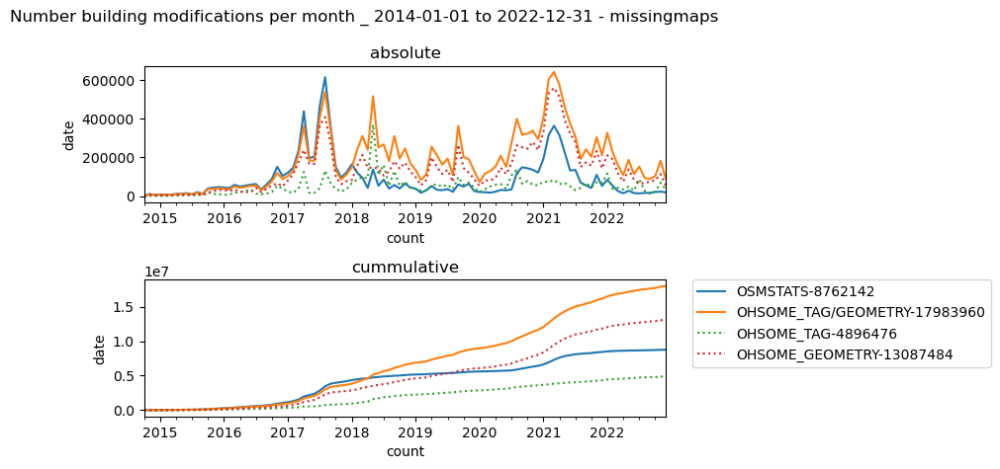

# Comparison of the OSM statistics
Here we compare some core OSM statistics (e.g. number of users, buildings created, ...) derived from three different databases:

* changeset-db: https://github.com/ToeBee/ChangesetMD
* osm-stats-api: https://github.com/hotosm/osm-stats
* ohsome framework: https://github.com/GIScience/oshdb

## Summary
The osmstats-api and the ohsome framework derive similar values when it comes to number of changesets, number of OSM users and features created.
When it comes to modifications the results show a bigger variance, which needs to be investigated further.

## Changeset Counts

| hashtag              | timerange                    | CHDB      | OSMSTATS  | OHSOME    |
|----------------------|------------------------------|-----------|-----------|-----------|
| MissingMaps          | ['2017-01-01', '2017-12-31'] | 1,121,267 | 1,089,181 | 1,112,610 |
| bloomberg            | ['2017-01-01', '2017-12-31'] | 1,429     | 1,419     | 1,419     |
| hotosm-project-*     | ['2017-01-01', '2017-12-31'] | 1,610,104 | 1,580,420 | 1,597,126 |
| MissingMaps          | ['2022-01-01', '2023-02-07'] | 293,747   | 291,969   | 292,483   |
| bloomberg            | ['2022-01-01', '2023-02-07'] | 8,091     | 7,935     | 8,055     |
| visa                 | ['2022-01-01', '2023-02-07'] | 1,821     | 1,230     | 1,820     |
| hotosm-project-14154 | ['2022-01-01', '2023-02-07'] | 108       | 108       | 108       |
| hotosm-project-*     | ['2022-01-01', '2023-02-07'] | 1,361,236 | 1,354,439 | 1,352,537 |

The results show that both, the osmstats-api and ohsome-framework do not contain all changesets.
While some hashtags, e.g. the `bloomberg` or the `hotosm-project-14154` show results with no difference, the counts for the osm-stats-api tend to be the lowest.
ChangesetDB always shows the highest count and this can be considered the `true` count.
The results for `visa` also include the hashtag for example `visayasGrid`.
This shows that a simple `startswith` filter can result in misleading numbers for some hashtags.


### Potential sources for differences
#### Parsing of hashtags
The following code snippet is, used to extract the hashtags used to extract the hashtags, stored in the OSM STATS API. 

```javascript
const HASHTAG_REGEX = /(#[^\u2000-\u206F\u2E00-\u2E7F\s\\'!"#$%()*,./:;<=>?@[\]^`{|}~]+)/g;

const extractHashtags = tags => {
  tags.comment = htmlEntities.decode(tags.comment);
  return ((tags.comment || "").match(HASHTAG_REGEX) || []).map(x =>
    x.slice(1).toLowerCase());
};

```

Yet a changesets tags element can contain a separate hashtags attribute, which is generated in most cases by the editor.
The OSM STATS API will miss changesets for which the hashtags are only included in the `hashtags` attribute of a changeset, but not in the `comment` attribute of a changeset.
In case for the hashtag `missingmaps` this accounts for roughly half of the missing changesets.

#### Applied Filters
The ChangesetDB does not apply any kind of filter and therefore includes all changesets into the DB.
The OSM STATS API applies the following conditions on changesets and as such only considers changesets which contain nodes or ways for the categories Building, POI, Road or Waterway.

```javascript
const isInteresting = feature =>
  ["node", "way"].includes(feature.properties.type) &&
  (isBuilding(feature) ||
    isPOI(feature) ||
    isRoad(feature) ||
    isWaterway(feature));
```

The ohsome framework also includes only contributions to nodes or ways, but considers all tags.
As a consequence, changesets only containing relations are currently not included in the counts.

## Number of unique users
In general, all approaches provide similar results for the number of unique users per hashtag.
Similar to the number of changesets, the results for osmstats-api and ohsome framework show slightly lower values compared to the changeset DB.
For the number of users this effect is less pronounced than for number of changesets.

| hashtag              | timerange                    | CHDB   | OSMSTATS | OHSOME |
|----------------------|------------------------------|--------|----------|--------|
| MissingMaps          | ['2017-01-01', '2017-12-31'] | 28,446 | 28,240   | 28,395 |
| bloomberg            | ['2017-01-01', '2017-12-31'] | 137    | 137      | 137    |
| hotosm-project-*     | ['2017-01-01', '2017-12-31'] | 42,901 | 42,550   | 42,818 |
| MissingMaps          | ['2022-01-01', '2023-02-07'] | 11,793 | 11,636   | 11,774 |
| bloomberg            | ['2022-01-01', '2023-02-07'] | 572    | 550      | 572    |
| visa                 | ['2022-01-01', '2023-02-07'] | 175    | 122      | 175    |
| hotosm-project-14154 | ['2022-01-01', '2023-02-07'] | 15     | 15       | 15     |
| hotosm-project-*     | ['2022-01-01', '2023-02-07'] | 48,149 | 47,970   | 48,045 |


## Feature based statistics (e.g. building count)
The following statistics have been calculated only for changesets, which are present in both the osmstats-api and ohsome framework.
This allows us to compare if there are differences in the overall number of features (e.g. buildings) mapped.

### Number of buildings created
Both approaches provide very similar results in regard to the number of buildings created for a given hashtag.
The results are slightly lower for the osmstat-api compared to the ohsome framework.
Nevertheless, the relative difference is usually on a few percents.
When filtering for all HOT Tasking Manager projects (`hotosm-project-*`) there is a difference of about 10% for the year 2017, but this gap didn't show up for the year 2022.

| hashtag              | timerange                    | OSMSTATS | OHSOME | Abs Difference | Rel Difference |
|----------------------|------------------------------|-----------------------------|--------------------------|----------------|----------------|
| MissingMaps          | ['2017-01-01', '2017-12-31'] | 15,562,631                  | 15,651,562               | -88,931        | 0.994          |
| bloomberg            | ['2017-01-01', '2017-12-31'] | 8,958                       | 9,079                    | -121           | 0.986          |
| hotosm-project-*     | ['2017-01-01', '2017-12-31'] | 23,162,134                  | 25,234,051               | -2,071,917     | 0.917          |
| MissingMaps          | ['2022-01-01', '2023-02-07'] | 4,768,705                   | 4,989,039                | -220,334       | 0.955          |
| bloomberg            | ['2022-01-01', '2023-02-07'] | 63,940                      | 64,201                   | -261           | 0.995          |
| visa                 | ['2022-01-01', '2023-02-07'] | 6,074                       | 6,461                    | -387           | 0.940          |
| hotosm-project-14154 | ['2022-01-01', '2023-02-07'] | 1,460                       | 1,460                    | 0              | 1              |
| hotosm-project-*     | ['2022-01-01', '2023-02-07'] | 20,747,261                  | 20,859,534               | -112,273       | 0.994          |

### Number of buildings modified
Both approaches provide different numbers in regard to the number of buildings modified for a given hashtag.
Whereas the osm-stats api reported higher values for the year 2017, this has changed dramatically for the year 2022.
For the year 2022 there is a big difference for both approaches.
The ohsome framework reports much higher values for building modifications in that year.

| hashtag              | timerange                    | OSMSTATS | OHSOME | Abs Difference | Rel Difference |
|----------------------|------------------------------|--------------------------------|------------------------------|----------------|----------------|
| MissingMaps          | ['2017-01-01', '2017-12-31'] | 3,145,157                      | 2,760,304                    | 384,853        | 1.139          |
| bloomberg            | ['2017-01-01', '2017-12-31'] | 683                            | 537                          | 146            | 1.271          |
| hotosm-project-*     | ['2017-01-01', '2017-12-31'] | 4,369,281                      | 4,143,332                    | 225,949        | 1.054          |
| MissingMaps          | ['2022-01-01', '2023-02-07'] | 364,686                        | 1,938,736                    | -1,574,050     | 0.188          |
| bloomberg            | ['2022-01-01', '2023-02-07'] | 3,570                          | 17,018                       | -13,448        | 0.209          |
| visa                 | ['2022-01-01', '2023-02-07'] | 270                            | 468                          | -198           | 0.576          |
| hotosm-project-14154 | ['2022-01-01', '2023-02-07'] | 19                             | 519                          | -500           | 0.036          |
| hotosm-project-*     | ['2022-01-01', '2023-02-07'] | 1,749,869                      | 7,446,845                    | -5,696,976     | 0.234          |

The figure shows the temporal evolution of building modifications on a monthly basis.
Since 2018 there is a mismatch between both approaches.
It is not really clear what is the cause for this.



### Number of roads created
Both approaches provide similar results in regard to the number of roads created for a given hashtag.
The ohsome framework usually reports slightly higher numbers.

| hashtag              | timerange                    | OSMSTATS | OHSOME | Abs Difference | Rel Difference |
|----------------------|------------------------------|------------------------|----------------------|----------------|----------------|
| MissingMaps          | ['2017-01-01', '2017-12-31'] | 816,890                | 825,439              | -8,549         | 0.989          |
| bloomberg            | ['2017-01-01', '2017-12-31'] | 394                    | 399                  | -5             | 0.987          |
| hotosm-project-*     | ['2017-01-01', '2017-12-31'] | 1,458,623              | 1,688,745            | -230,122       | 0.863          |
| MissingMaps          | ['2022-01-01', '2023-02-07'] | 108,869                | 120,244              | -11,375        | 0.905          |
| bloomberg            | ['2022-01-01', '2023-02-07'] | 387                    | 404                  | -17            | 0.957          |
| hotosm-project-14154 | ['2022-01-01', '2023-02-07'] | 2                      | 2                    | 0              | 1              |
| hotosm-project-*     | ['2022-01-01', '2023-02-07'] | 639,144                | 643,439              | -4,295         | 0.993          |

### Number of roads modified
Here we see a similar trend observed already for the number of buildings modified.
There seems to be a systematic mismatch between the approaches employed by the osmstats-api and the ohsome framework.

| hashtag              | timerange                    | OSMSTATS | OHSOME | Abs Difference | Rel Difference |
|----------------------|------------------------------|-----------------------------|--------------------------|----------------|----------------|
| MissingMaps          | ['2017-01-01', '2017-12-31'] | 896,427                     | 744,845                  | 151,582        | 1.203          |
| bloomberg            | ['2017-01-01', '2017-12-31'] | 123                         | 113                      | 10             | 1.088          |
| hotosm-project-*     | ['2017-01-01', '2017-12-31'] | 1,767,305                   | 1,651,445                | 115,860        | 1.070          |
| MissingMaps          | ['2022-01-01', '2023-02-07'] | 177,086                     | 221,771                  | -44,685        | 0.798          |
| bloomberg            | ['2022-01-01', '2023-02-07'] | 1,249                       | 1,488                    | -239           | 0.839          |
| visa                 | ['2022-01-01', '2023-02-07'] | 210                         | 247                      | -37            | 0.850          |
| hotosm-project-14154 | ['2022-01-01', '2023-02-07'] | 10                          | 11                       | -1             | 0.909          |
| hotosm-project-*     | ['2022-01-01', '2023-02-07'] | 959,000                     | 1,152,522                | -193,522       | 0.832          |

### Length of roads created
| hashtag              | timerange                    | OSMSTATS | OHSOME | Abs Difference | Rel Difference |
|----------------------|------------------------------|------------------------|----------------------|----------------|----------------|
| MissingMaps          | ['2017-01-01', '2017-12-31'] | 275,551.886            | 282,821.936          | -7,270.050     | 0.974          |
| bloomberg            | ['2017-01-01', '2017-12-31'] | 187.099                | 188.243              | -1.143         | 0.994          |
| hotosm-project-*     | ['2017-01-01', '2017-12-31'] | 538,497.595            | 614,547.683          | -76,050.088    | 0.876          |
| MissingMaps          | ['2022-01-01', '2023-02-07'] | 41,817.656             | 46,055.171           | -4,237.515     | 0.908          |
| bloomberg            | ['2022-01-01', '2023-02-07'] | 168.188                | 176.879              | -8.691         | 0.951          |
| hotosm-project-14154 | ['2022-01-01', '2023-02-07'] | 1.755                  | 1.753                | 0.002          | 1.001          |
| hotosm-project-*     | ['2022-01-01', '2023-02-07'] | 238,937.373            | 244,536.037          | -5,598.664     | 0.977          |

### Length of roads modified
| hashtag              | timerange                    | OSMSTATS                | OHSOME | Abs Difference   | Rel Difference |
|----------------------|------------------------------|-------------------------|--------------------------|------------------|----------------|
| MissingMaps          | ['2017-01-01', '2017-12-31'] | 73,497.899              | 71,246.995               | 2,250.904        | 1.032          |
| bloomberg            | ['2017-01-01', '2017-12-31'] | 4.065                   | 3.772                    | 0.293            | 1.078          |
| hotosm-project-*     | ['2017-01-01', '2017-12-31'] | 159,723.318             | 168,875.290              | -9,151.972       | 0.946          |
| MissingMaps          | ['2022-01-01', '2023-02-07'] | 22,475.689              | 15,921.491               | 6,554.198        | 1.412          |
| bloomberg            | ['2022-01-01', '2023-02-07'] | 47.546                  | 44.923                   | 2.623            | 1.058          |
| visa                 | ['2022-01-01', '2023-02-07'] | 0.390                   | 0.322                    | 0.068            | 1.211          |
| hotosm-project-14154 | ['2022-01-01', '2023-02-07'] | 0.662                   | 0.597                    | 0.065            | 1.108          |
| hotosm-project-*     | ['2022-01-01', '2023-02-07'] | 101,521.449             | 70,975.174               | 30,546.275       | 1.430          |


## How to differentiate between modifications and creations
In the following we differentiate between modifications and creations.
For the ohsome framework, the following sql query is used to classify the contributions into either `creation` or `modification`.

```SQL 
SUM(CASE WHEN (road_length == 0and road_length_delta < 0) THEN ABS(road_length_delta) ELSE 0 END) as deletionsRoad_length,
SUM(CASE WHEN (road_length > 0and road_length_delta == road_length) THEN ABS(road_length_delta) ELSE 0 END) as creationsRoad_length,
SUM(CASE WHEN (road_length > 0and road_length_delta != road_length) THEN ABS(road_length_delta) ELSE 0 END) as modificationsRoad_length
```

The OSM STATS API uses the version of an OSM object to differentiate between a creation and modification.
This approach will not cover changes for ways, which only consider the geometry, e.g. when the building geometry has been adjusted.
Since the OSM STATS API uses the absolute value of the difference between modifications to calculate the difference between two versions, the same is applied to the road_length_delta. 

```javascript
module.exports.isModified = ({ properties: { version } }) =>
  Number(version) > 1;

module.exports.isNew = ({ properties: { version } }) => Number(version) === 1;

\\calculation of the diffrences
module.exports = (prev, next) =>
  isWay(prev) && isWay(next) && isRoad(prev) && isRoad(next)
    ? Math.abs(
        length(prev, { units: "kilometers" }) -
          length(next, { units: "kilometers" })
      )
    : 0;
```

