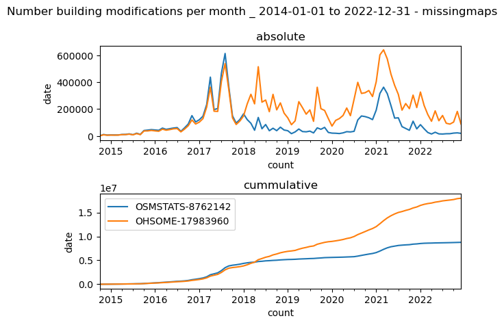

# Comparison of the free datasource's Changeset DB, OSM STATS API and OHSOME NOW

## Changeset Counts

### Stats
| hashtag              | timerange                    | CHDB      | OSMSTATS  | OHSOME    |
|----------------------|------------------------------|-----------|-----------|-----------|
| MissingMaps          | ['2017-01-01', '2017-12-31'] | 1121,267  | 1,089,181 | 1,112,610 |
| bloomberg            | ['2017-01-01', '2017-12-31'] | 1,429     | 1,419     | 1,419     |
| hotosm-project-*     | ['2017-01-01', '2017-12-31'] | 1,610,104 | 1,580,420 | 1,597,126 |
| MissingMaps          | ['2022-01-01', '2023-02-07'] | 293,747   | 291,969   | 292,483   |
| bloomberg            | ['2022-01-01', '2023-02-07'] | 8,091     | 7,935     | 8,055     |
| visa                 | ['2022-01-01', '2023-02-07'] | 1,821     | 1,230     | 1,820     |
| hotosm-project-14154 | ['2022-01-01', '2023-02-07'] | 108       | 108       | 108       |
| hotosm-project-*     | ['2022-01-01', '2023-02-07'] | 1,361,236 | 1,354,439 | 1,352,537 |

Thh Results show that both, the OSM STATS API and OHSOME NOW are not containing all changesets. While some hashtags, e.g. the bloomberg
or the hotosm-project-14154 show results with no difference, the counts for the OSM STATS API tend to be the lowest, while the changesetDB constantly the highest count.

Since we allow slight variation of the hashtag , results for visa also include the hashtag for example #VisayasGrid. This affects primarly the results for ChangesetDB and OHSOME
### Potential sources for diffrences

#### Parsing of hashtags

The following code snippet is, used to extract the hashtags used to extract the hashtags, stored in the OSM STATS API. 

```javascript
const HASHTAG_REGEX = /(#[^\u2000-\u206F\u2E00-\u2E7F\s\\'!"#$%()*,./:;<=>?@[\]^`{|}~]+)/g;

const extractHashtags = tags => {
  tags.comment = htmlEntities.decode(tags.comment);
  return ((tags.comment || "").match(HASHTAG_REGEX) || []).map(x =>
    x.slice(1).toLowerCase());
};

```

Yet a changesets tags element, can contain a seperate hashtags, attribute, which is generated in most cases by the editor.
Incase the user decides to assing, tha hashtags independently from the comment attribute, the consequence will be that the OSM STATS API will miss these.

In case for the MissingMaps hashtag, this e.g. accounts for roughly half of the missing changesets.

#### Applied Filters
The ChangesetDB does not apply any kind of filter and therefore includes all changesets into the DB.

The OSM STATS API applies the following conditions on changesets, before processing and including a contribution to the database.

```javascript
const isInteresting = feature =>
  ["node", "way"].includes(feature.properties.type) &&
  (isBuilding(feature) ||
    isPOI(feature) ||
    isRoad(feature) ||
    isWaterway(feature));
```

The OHSOME NOW Database, also includes only contributions to nodes, or ways.
Both, has as consequence, that changesets, containing only relations are currently not included in the counts.

## UNIQUE USERS

The counts for individual users diverge less, in comparison to the OSM STATS 

| hashtag              | timerange                    | CHDB   | OSTMSTATS | OHSOME |
|----------------------|------------------------------|--------|-----------|--------|
| MissingMaps          | ['2017-01-01', '2017-12-31'] | 28,446 | 28,240    | 28,395 |
| bloomberg            | ['2017-01-01', '2017-12-31'] | 137    | 137       | 137    |
| hotosm-project-*     | ['2017-01-01', '2017-12-31'] | 42,901 | 42,550    | 42,818 |
| MissingMaps          | ['2022-01-01', '2023-02-07'] | 11,793 | 11,636    | 11,774 |
| bloomberg            | ['2022-01-01', '2023-02-07'] | 572    | 550       | 572    |
| visa                 | ['2022-01-01', '2023-02-07'] | 175    | 122       | 175    |
| hotosm-project-14154 | ['2022-01-01', '2023-02-07'] | 15     | 15        | 15     |
| hotosm-project-*     | ['2022-01-01', '2023-02-07'] | 48,149 | 47,970    | 48,045 |

## Contributions payload

As the Statistics above show, some changesets are missing, to account for this, the following statistics have been calculated only for changesets, which are present in both the OSM STATS API and OHSOME NOW.
### queries (differentiation betweent creation and modification)

The following SQL QUERY is used to classify the contributions. road_length is the length of a contribution, after the contribution, road_length_delta is the diffrence betweent the length before and after 
```SQL 
SUM(CASE WHEN (road_length == 0and road_length_delta < 0) THEN ABS(road_length_delta) ELSE 0 END) as deletionsRoad_length,
SUM(CASE WHEN (road_length > 0and road_length_delta == road_length) THEN ABS(road_length_delta) ELSE 0 END) as creationsRoad_length,
SUM(CASE WHEN (road_length > 0and road_length_delta != road_length) THEN ABS(road_length_delta) ELSE 0 END) as modificationsRoad_length
```

The OSM STATS API uses the version of an OSM object to differentiate between a creation and modification.

```javascript
module.exports.isModified = ({ properties: { version } }) =>
  Number(version) > 1;

module.exports.isNew = ({ properties: { version } }) => Number(version) === 1;

\\calculation of the diffrences
module.exports = (prev, next) =>
  isWay(prev) && isWay(next) && isRoad(prev) && isRoad(next)
    ? Math.abs(
        length(prev, { units: "kilometers" }) -
          length(next, { units: "kilometers" })
      )
    : 0;
```
Since the OSM STATS API uses the absolute value of the diffrence between modifications to calculate the difference between two versions, the same is applied to the road_length_delta. 
### building counts

#### creations
| hashtag              | timerange                    | creationsBuildingsOSMSTATS | creationsBuildingsOHSOME | creationBuildingsAbsDiffrence | creationBuildingsRelDiffrence |
|----------------------|------------------------------|----------------------------|--------------------------|-------------------------------|-------------------------------|
| MissingMaps          | ['2017-01-01', '2017-12-31'] | 15,562,631                 | 15,651,562               | -88,931                       | 0.994                         |
| bloomberg            | ['2017-01-01', '2017-12-31'] | 8,958                      | 9,079                    | -121                          | 0.986                         |
| hotosm-project-*     | ['2017-01-01', '2017-12-31'] | 23,162,134                 | 25,234,051               | -2,071,917                    | 0.917                         |
| MissingMaps          | ['2022-01-01', '2023-02-07'] | 4,768,705                  | 4,989,039                | -220,334                      | 0.955                         |
| bloomberg            | ['2022-01-01', '2023-02-07'] | 63,940                     | 64,201                   | -261                          | 0.995                         |
| visa                 | ['2022-01-01', '2023-02-07'] | 6,074                      | 6,461                    | -387                          | 0.940                         |
| hotosm-project-14154 | ['2022-01-01', '2023-02-07'] | 1,460                      | 1,460                    | 0                             | 1                             |
| hotosm-project-*     | ['2022-01-01', '2023-02-07'] | 20,747,261                 | 20,859,534               | -112,273                      | 0.994                         |

#### modifications
| hashtag              | timerange                    | modificationsBuildingsOSMSTATS | modificationsBuildingsOHSOME | modificationsBuildingsAbsDiffrence | modificationsBuildingsRelDiffrence |
|----------------------|------------------------------|--------------------------------|------------------------------|------------------------------------|------------------------------------|
| MissingMaps          | ['2017-01-01', '2017-12-31'] | 3,145,157                      | 2,760,304                    | 384,853                            | 1.139                              |
| bloomberg            | ['2017-01-01', '2017-12-31'] | 683                            | 537                          | 146                                | 1.271                              |
| hotosm-project-*     | ['2017-01-01', '2017-12-31'] | 4,369,281                      | 4,143,332                    | 225,949                            | 1.054                              |
| MissingMaps          | ['2022-01-01', '2023-02-07'] | 364,686                        | 1,938,736                    | -1,574,050                         | 0.188                              |
| bloomberg            | ['2022-01-01', '2023-02-07'] | 3,570                          | 17,018                       | -13,448                            | 0.209                              |
| visa                 | ['2022-01-01', '2023-02-07'] | 270                            | 468                          | -198                               | 0.576                              |
| hotosm-project-14154 | ['2022-01-01', '2023-02-07'] | 19                             | 519                          | -500                               | 0.036                              |
| hotosm-project-*     | ['2022-01-01', '2023-02-07'] | 1,749,869                      | 7,446,845                    | -5,696,976                         | 0.234                              |


### road count

#### creations

| hashtag              | timerange                    | creationsroadsOSMSTATS | creationsroadsOHSOME | creationroadsAbsDifference | creationroadsRelDiffrence |
|----------------------|------------------------------|------------------------|----------------------|---------------------------|---------------------------|
| MissingMaps          | ['2017-01-01', '2017-12-31'] | 816,890                | 825,439              | -8,549                    | 0.989                     |
| bloomberg            | ['2017-01-01', '2017-12-31'] | 394                    | 399                  | -5                        | 0.987                     |
| hotosm-project-*     | ['2017-01-01', '2017-12-31'] | 1,458,623              | 1,688,745            | -230,122                  | 0.863                     |
| MissingMaps          | ['2022-01-01', '2023-02-07'] | 108,869                | 120,244              | -11,375                   | 0.905                     |
| bloomberg            | ['2022-01-01', '2023-02-07'] | 387                    | 404                  | -17                       | 0.957                     |
| visa                 | ['2022-01-01', '2023-02-07'] | 0                      | 0                    | 0                         |                           |
| hotosm-project-14154 | ['2022-01-01', '2023-02-07'] | 2                      | 2                    | 0                         | 1                         |
| hotosm-project-*     | ['2022-01-01', '2023-02-07'] | 639,144                | 643,439              | -4,295                    | 0.993                     |

#### modifications
| hashtag              | timerange                    | moodificationsroadsOSMSTATS | modificationsroadsOHSOME | modificationsroadsAbsDifference | modificationsroadsRelDiffrence |
|----------------------|------------------------------|-----------------------------|--------------------------|---------------------------------|--------------------------------|
| MissingMaps          | ['2017-01-01', '2017-12-31'] | 896,427                     | 744,845                  | 151,582                         | 1.203                          |
| bloomberg            | ['2017-01-01', '2017-12-31'] | 123                         | 113                      | 10                              | 1.088                          |
| hotosm-project-*     | ['2017-01-01', '2017-12-31'] | 1,767,305                   | 1,651,445                | 115,860                         | 1.070                          |
| MissingMaps          | ['2022-01-01', '2023-02-07'] | 177,086                     | 221,771                  | -44,685                         | 0.798                          |
| bloomberg            | ['2022-01-01', '2023-02-07'] | 1,249                       | 1,488                    | -239                            | 0.839                          |
| visa                 | ['2022-01-01', '2023-02-07'] | 210                         | 247                      | -37                             | 0.850                          |
| hotosm-project-14154 | ['2022-01-01', '2023-02-07'] | 10                          | 11                       | -1                              | 0.909                          |
| hotosm-project-*     | ['2022-01-01', '2023-02-07'] | 959,000                     | 1,152,522                | -193,522                        | 0.832                          |

### road length in km

#### creations
| hashtag              | timerange                    | creationsroadsOSMSTATS | creationsroadsOHSOME | creationroadsAbsDifference | creationroadsRelDifference |
|----------------------|------------------------------|------------------------|----------------------|---------------------------|----------------------------|
| MissingMaps          | ['2017-01-01', '2017-12-31'] | 275,551.886            | 282,821.936          | -7,270.050                | 0.974                      |
| bloomberg            | ['2017-01-01', '2017-12-31'] | 187.099                | 188.243              | -1.143                    | 0.994                      |
| visa                 | ['2017-01-01', '2017-12-31'] | 0.000                  | 0.000                | 0.000                     |                            |
| hotosm-project-14154 | ['2017-01-01', '2017-12-31'] | 0.000                  | 0.000                | 0.000                     |                            |
| hotosm-project-*     | ['2017-01-01', '2017-12-31'] | 538,497.595            | 614,547.683          | -76,050.088               | 0.876                      |
| MissingMaps          | ['2022-01-01', '2023-02-07'] | 41,817.656             | 46,055.171           | -4,237.515                | 0.908                      |
| bloomberg            | ['2022-01-01', '2023-02-07'] | 168.188                | 176.879              | -8.691                    | 0.951                      |
| visa                 | ['2022-01-01', '2023-02-07'] | 0.000                  | 0.000                | 0.000                     |                            |
| hotosm-project-14154 | ['2022-01-01', '2023-02-07'] | 1.755                  | 1.753                | 0.002                     | 1.001                      |
| hotosm-project-*     | ['2022-01-01', '2023-02-07'] | 238,937.373            | 244,536.037          | -5,598.664                | 0.977                      |

#### modifications
| hashtag              | timerange                    | moodificationsroadsOSMSTATS | modificationsroadsOHSOME | modificationsroadsAbsDiffrence | modificationsroadsRelDiffrence |
|----------------------|------------------------------|-----------------------------|--------------------------|--------------------------------|--------------------------------|
| MissingMaps          | ['2017-01-01', '2017-12-31'] | 73,497.899                  | 71,246.995               | 2,250.904                      | 1.032                          |
| bloomberg            | ['2017-01-01', '2017-12-31'] | 4.065                       | 3.772                    | 0.293                          | 1.078                          |
| visa                 | ['2017-01-01', '2017-12-31'] | 0.000                       | 0.000                    | 0.000                          |                                |
| hotosm-project-14154 | ['2017-01-01', '2017-12-31'] | 0.000                       | 0.000                    | 0.000                          |                                |
| hotosm-project-*     | ['2017-01-01', '2017-12-31'] | 159,723.318                 | 168,875.290              | -9,151.972                     | 0.946                          |
| MissingMaps          | ['2022-01-01', '2023-02-07'] | 22,475.689                  | 15,921.491               | 6,554.198                      | 1.412                          |
| bloomberg            | ['2022-01-01', '2023-02-07'] | 47.546                      | 44.923                   | 2.623                          | 1.058                          |
| visa                 | ['2022-01-01', '2023-02-07'] | 0.390                       | 0.322                    | 0.068                          | 1.211                          |
| hotosm-project-14154 | ['2022-01-01', '2023-02-07'] | 0.662                       | 0.597                    | 0.065                          | 1.108                          |
| hotosm-project-*     | ['2022-01-01', '2023-02-07'] | 101,521.449                 | 70,975.174               | 30,546.275                     | 1.430                          |

